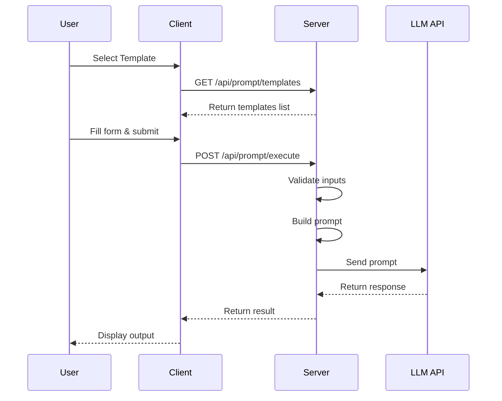
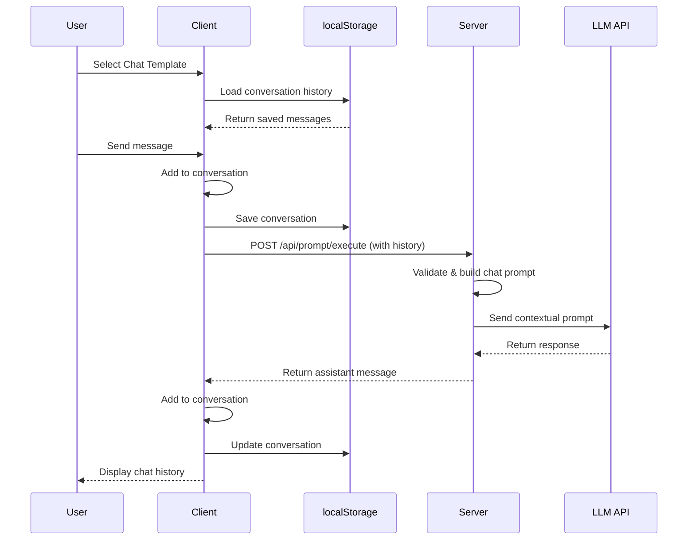

# AI Prompt Studio - Architecture Documentation

## Overview

AI Prompt Studio is a full-stack web application that provides a user-friendly interface for interacting with Large Language Models (LLMs) through predefined templates. The application consists of a React frontend and an Express.js backend, designed for prompt engineering and AI-powered task completion.

## System Architecture

### High-Level Architecture

```
┌─────────────────┐    HTTP/HTTPS    ┌─────────────────┐
│                 │                  │                 │
│   React Client  │◄────────────────►│  Express Server │
│   (Vite)        │                  │   (Node.js)     │
│                 │                  │                 │
└─────────────────┘                  └─────────────────┘
         │                                   │
         │                                   │
         ▼                                   ▼
┌─────────────────┐                  ┌─────────────────┐
│   Browser       │                  │   LLM APIs      │
│   localStorage  │                  │   (Groq/OpenAI) │
└─────────────────┘                  └─────────────────┘
```

### Component Architecture

#### Frontend Architecture

```
App.jsx (Main Container)
├── TemplateList.jsx (Template Selection)
├── DynamicForm.jsx (Input Form Generation)
├── ChatOutputRenderer.jsx (Chat Interface)
├── OutputRenderer.jsx (Standard Output Display)
└── ModelSelector.jsx (Model Selection)
```

#### Backend Architecture

```
server/
├── index.js (Express App Entry)
├── routes/
│   ├── prompt.route.js (Template & Execution)
│   └── model.route.js (Model Configuration)
├── services/
│   ├── promptBuilder.js (Prompt Construction)
│   └── llm.service.js (LLM API Integration)
├── templates/
│   └── templates.js (Template Definitions)
└── config/
    ├── models.js (Model Configurations)
    └── env.js (Environment Variables)
```

## Data Flow Diagrams

### Standard Template Execution Flow



### Chat Template Execution Flow



## Component Hierarchy

### Frontend Component Tree

```
App
├── Header/Logo
├── MainContent
│   ├── LeftPanel
│   │   ├── TemplateList
│   │   │   └── TemplateButton[]
│   │   ├── DynamicForm
│   │   │   ├── FormField[]
│   │   │   └── SubmitButton
│   │   └── Loading/Error Messages
│   └── RightPanel
│       ├── ChatOutputRenderer (for chat template)
│       │   ├── ChatHeader
│       │   │   └── ClearButton
│       │   ├── MessagesContainer
│       │   │   └── ChatMessage[]
│       │   └── TypingIndicator
│       └── OutputRenderer (for other templates)
│           ├── OutputHeader
│           │   ├── Title
│           │   └── ActionButtons
│           └── OutputContent
```

### State Management

#### Client State Structure

```javascript
{
  template: {
    id: string,
    title: string,
    description: string,
    inputs: InputField[],
    systemPrompt: string
  },
  conversation: ChatMessage[], // For chat template
  result: string, // For other templates
  loading: boolean,
  error: string
}

ChatMessage = {
  role: 'user' | 'assistant',
  content: string,
  timestamp: Date
}
```

## API Design

### RESTful Endpoints

#### Prompt Management
- `GET /api/prompt/templates` - Retrieve available templates
- `POST /api/prompt/execute` - Execute a prompt with inputs

#### Model Management
- `GET /api/models` - Retrieve available AI models

### Request/Response Schemas

#### Template List Response
```json
[
  {
    "id": "chat-with-ai",
    "title": "Chat with AI",
    "description": "Have a free-form conversation",
    "inputs": [
      {
        "name": "Your Message",
        "type": "textarea",
        "required": true
      }
    ],
    "systemPrompt": "You are a helpful AI assistant..."
  }
]
```

#### Prompt Execution Request
```json
{
  "templateId": "chat-with-ai",
  "inputs": {
    "modelId": "groq-llama-3.1-8b",
    "Your Message": "Hello!",
    "conversationHistory": [
      {
        "role": "user",
        "content": "Previous message",
        "timestamp": "2024-01-01T00:00:00.000Z"
      }
    ]
  }
}
```

#### Prompt Execution Response
```json
{
  "result": "Hello! How can I help you today?"
}
```

## Security Architecture

### Input Validation Layers

1. **Client-Side Validation**
   - Input length limits
   - Required field checks
   - Type validation

2. **Server-Side Validation**
   - Request structure validation
   - Template existence checks
   - Input sanitization (XSS prevention)
   - Rate limiting

### Data Sanitization

- HTML/script tag removal from user inputs
- JSON validation for structured data
- Length limits on all text inputs

## Performance Optimizations

### Frontend Optimizations

1. **Memoization**
   - React.memo for components
   - useCallback for event handlers
   - useMemo for expensive calculations

2. **Lazy Loading**
   - Component code splitting
   - Image lazy loading

3. **State Management**
   - Debounced localStorage saves
   - Conversation message limits (50 messages max)
   - Recent context limits (10 messages for API calls)

### Backend Optimizations

1. **Request Validation**
   - Early validation to prevent unnecessary processing
   - Input sanitization before processing

2. **Error Handling**
   - Structured error responses
   - Graceful degradation
   - Logging for debugging

## Deployment Architecture

### Development Environment

```
Local Development
├── Client: Vite dev server (port 5173)
├── Server: Nodemon dev server (port 5000)
└── Proxy: Vite proxy to server
```

### Production Environment

```
Production Deployment
├── Client: Static files served by web server
├── Server: Node.js application
├── Reverse Proxy: Nginx/Apache (optional)
└── SSL Termination: Web server or CDN
```

### Environment Configuration

```bash
# Client Environment Variables
VITE_SERVER_API_BASE=http://localhost:5000

# Server Environment Variables
GROQ_API_KEY=your_api_key
NODE_ENV=production
PORT=5000
```

## Monitoring & Logging

### Client-Side Monitoring

- Error boundaries for React errors
- Console warnings for localStorage failures
- User-friendly error messages

### Server-Side Monitoring

- Request logging
- Error logging with stack traces
- API rate limit monitoring
- LLM API error handling

## Future Enhancements

### Planned Features

1. **Offline Support**
   - Service Worker for caching
   - IndexedDB for persistent storage
   - Offline queue for failed requests

2. **Advanced Chat Features**
   - Message reactions
   - Conversation branching
   - Export/import conversations

3. **Multi-Modal Support**
   - Image upload and analysis
   - File processing templates

4. **Collaboration Features**
   - Shared templates
   - Team workspaces
   - Template versioning

### Scalability Considerations

1. **Database Integration**
   - User sessions
   - Template storage
   - Conversation history

2. **Caching Layer**
   - Redis for session storage
   - CDN for static assets

3. **Microservices Architecture**
   - Separate LLM service
   - Template management service
   - User management service